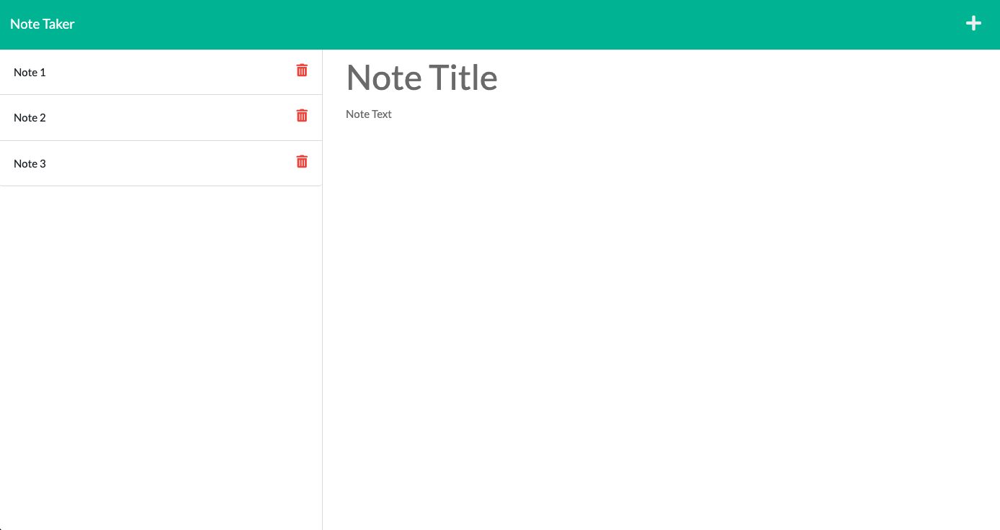

# Note Taker

In this application, the user is able to create notes by typing in both a title and text corresponding to it which could then be saved to the left hand side of the screen. The user can add as many notes as they would like and be able to delete them individually whenever they choose to. This project was created using HTML, CSS, JSON files, and Javascript with an emphasis on Express.js. Express.js was used to connect the back end development with the front end site.

## Table of Contents
* [Installation](#installation)
* [Questions](#questions)

## Installation
1. Install package.json using npm init -y
2. Install node modules, package-lock.json, and other packges needed using npm i express, and npm i uuidv4, and npm i.
3. Type in npm start to launch the local host and go to the http://localhost:3001/ port site to access application

## Questions
If you have any questions, please contact me via email at [kishan725@gmail.com](mailto:kishan725@gmail.com) or through github at [kishanshah98](https://github.com/kishanshah98)

## Heroku Deployed Link

[Deployed link](https://note-taker-application-ks.herokuapp.com/)
